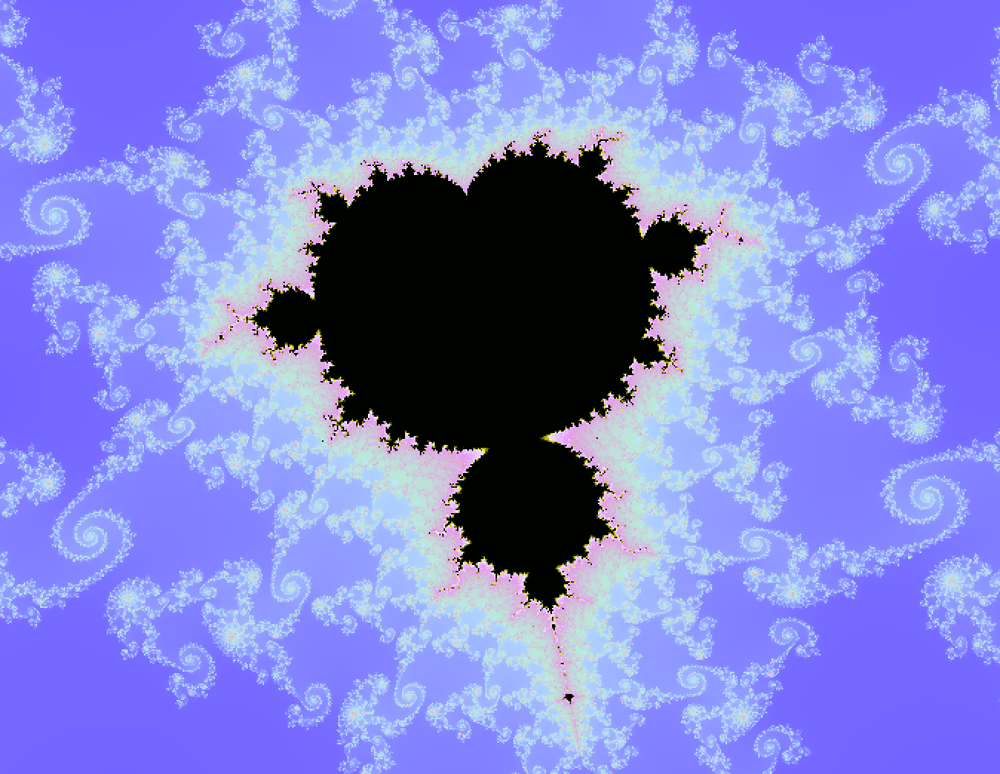

# Mandelbrot Set Visualization
This C++ based project generates and explores the Mandelbrot set using the SFML library for graphical rendering. 
The user can interact with the fractal visualization by zooming, moving, and adjusting the resolution.
Use the mouse scroll to change the number of maximum iterations for more detailed rendering.

